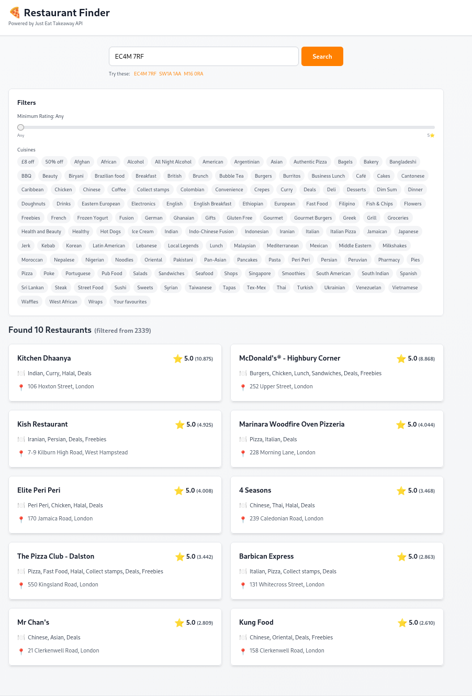
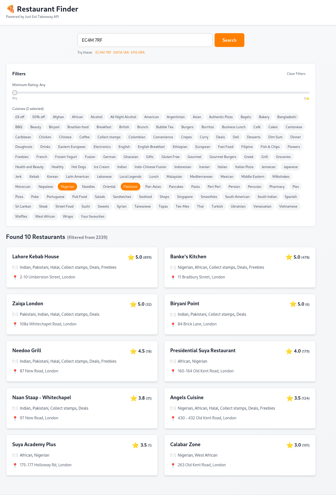
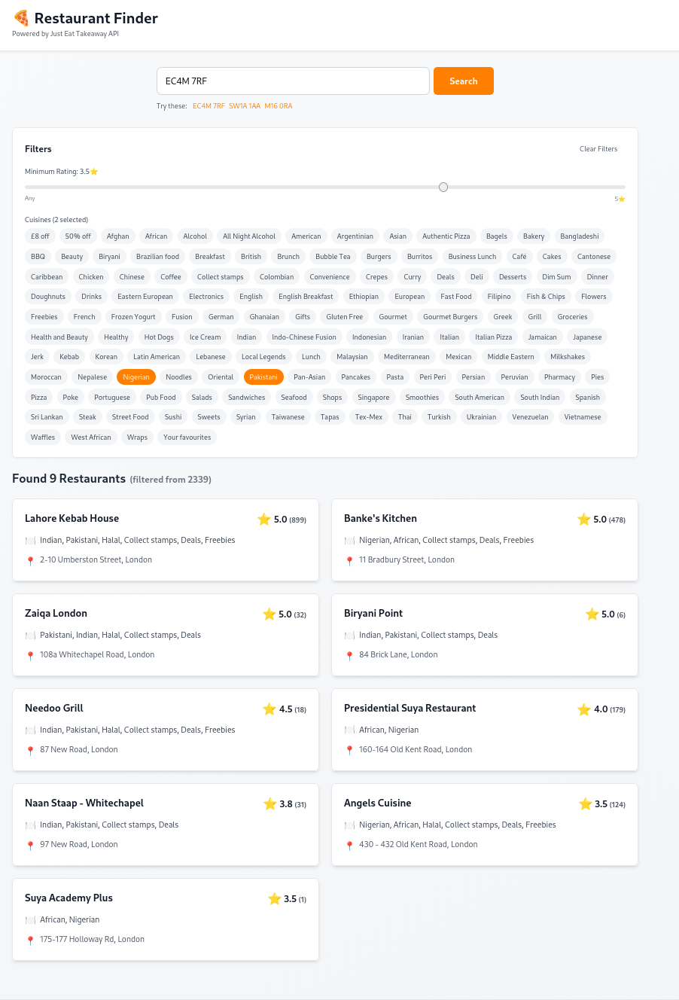
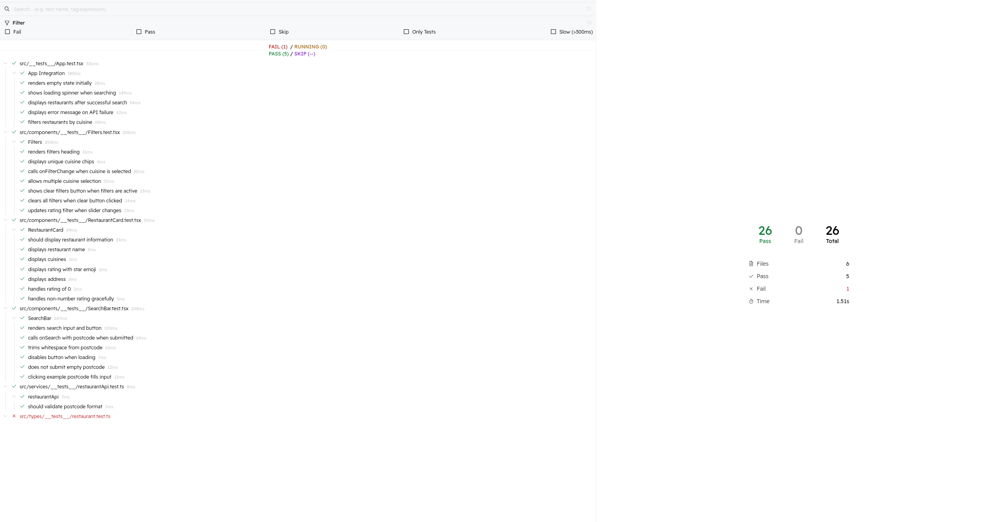

# 🍕 Restaurant Finder

> A full-stack TypeScript application for discovering restaurants in the UK using the Just Eat Takeaway API

---

## 📖 Table of Contents

- [Overview](#-overview)
- [Features](#-features)
  - [Core Functionality](#core-functionality)
  - [Technical Features](#technical-features)
- [Screenshots](#-screenshots)
- [Demo](#-demo)
- [Technology Stack](#️-technology-stack)
  - [Frontend](#frontend)
  - [Backend](#backend)
- [Prerequisites](#-prerequisites)
- [Installation](#-installation)
- [Usage](#-usage)
- [Project Structure](#-project-structure)
- [API Documentation](#-api-documentation)
- [Testing](#-testing)
  - [Test Coverage](#test-coverage)
  - [Example Test](#example-test)
- [Architecture Decisions](#️-architecture-decisions)
- [Future Enhancements](#-future-enhancements)
  - [Planned Features](#planned-features)
  - [Technical Improvements](#technical-improvements)
- [Troubleshooting](#-troubleshooting)
- [Development Workflow](#development-workflow)
- [Code Style](#code-style)

---

## 🎯 Overview

**Restaurant Finder** is a responsive web application that helps users discover restaurants in their area by searching UK postcodes. Built for the **Just Eat Takeaway Early Careers Program**, this project demonstrates proficiency in modern web development practices, TypeScript, React, and full-stack integration.

### Why This Project?

- **Real-world API integration** with Just Eat Takeaway
- **Type-safe development** using TypeScript throughout
- **Modern React patterns** including hooks, functional components, and proper state management
- **Production-ready architecture** with separation of concerns
- **Comprehensive testing** with 21 unit tests
- **Professional UI/UX** using Tailwind CSS

---

## ✨ Features

### Core Functionality

- 🔍 **Postcode Search**: Search for restaurants by UK postcode (e.g., "EC4M 7RF")
- 🍔 **Restaurant Display**: View top 10 restaurants with ratings, cuisines, and addresses
- 🏷️ **Cuisine Filtering**: Filter by multiple cuisines (Pizza, Indian, Chinese, etc.)
- ⭐ **Rating Filter**: Filter by minimum star rating (0-5 stars)
- 🔄 **Real-time Updates**: Instant UI updates when applying/removing filters
- 📱 **Responsive Design**: Works seamlessly on desktop, tablet, and mobile

### Technical Features

- ⚡ **Fast Performance**: Vite-powered development and optimized production builds
- 🛡️ **Type Safety**: Full TypeScript coverage prevents runtime errors
- 🧪 **Well-Tested**: 21 passing unit tests with Vitest
- 🎨 **Modern UI**: Tailwind CSS utility-first styling
- 🔐 **CORS Solution**: Backend proxy server for secure API communication
- 📊 **Smart Filtering**: OR logic for cuisines, sorted by rating

---

## 📸 Screenshots
 
### Initial Empty State

*Empty Search upon wrong post code*
 
### Restaurant Search Results

*Search results showing 10 restaurants with ratings, cuisines, and addresses*
 
### Cuisine Filtering

*Interactive cuisine filter chips for easy restaurant filtering*
 
### Rating Filter

*Slider control for filtering restaurants by minimum star rating*
 
### Test Coverage

*26 passing tests demonstrating comprehensive test coverage*


## 🎬 Demo

### Search Flow

```
1. Enter Postcode: "EC4M 7RF"
   ↓
2. View Results: 10 restaurants displayed
   ↓
3. Apply Filters: Select "Pizza" + "Rating ≥ 4.5"
   ↓
4. See Filtered Results: Top 10 highly-rated pizza places
```

### Example Postcodes to Try

- **EC4M 7RF** - Central London (2342 restaurants)
- **SW1A 1AA** - Westminster
- **M1 6RA** - Manchester
- **B1 1AA** - Birmingham

---

## 🛠️ Technology Stack

### Frontend

| Technology | Version | Purpose |
|------------|---------|---------|
| **React** | 18.2.0 | UI component library |
| **TypeScript** | 5.3.3 | Type-safe JavaScript |
| **Tailwind CSS** | 3.4.0 | Utility-first CSS framework |
| **Vite** | 5.0.0 | Build tool and dev server |
| **Vitest** | 1.0.0 | Unit testing framework |

### Backend

| Technology | Version | Purpose |
|------------|---------|---------|
| **Node.js** | 20.x | Runtime environment |
| **Express** | 4.18.2 | Web server framework |
| **CORS** | 2.8.5 | Cross-origin middleware |

---

## 📋 Prerequisites

Before you begin, ensure you have the following installed:

- **Node.js** (v18.0.0 or higher)
- **npm** (v9.0.0 or higher)
- **Git** (for cloning the repository)

Check your versions:

```bash
node --version  # Should be v18.0.0+
npm --version   # Should be v9.0.0+
```

---

## 🚀 Installation

### 1. Clone the Repository

```bash
git clone https://github.com/yourusername/restaurant-finder.git
cd restaurant-finder
```

### 2. Install Dependencies

```bash
npm install
```

This will install all required packages for both frontend and backend.

### 3. Verify Installation

```bash
npm test
```

You should see:

```
✓ 21 tests passing
```

---

## 💻 Usage

### Start the Application

```bash
npm start
```

This starts **both** the frontend and backend servers concurrently:

- **Frontend**: http://localhost:5173 (Vite dev server)
- **Backend**: http://localhost:3001 (Express proxy server)

### Alternative: Start Servers Separately

```bash
# Terminal 1 - Frontend only
npm run dev

# Terminal 2 - Backend only
npm run server
```

### Search for Restaurants

1. Open http://localhost:5173 in your browser
2. Enter a UK postcode (e.g., "EC4M 7RF")
3. Click "Search" or press Enter
4. Browse the results and apply filters as needed

### Stop the Application

Press `Ctrl + C` in the terminal to stop both servers.

---

## 📁 Project Structure

```
restaurant-finder/
├── src/
│   ├── components/          # React components
│   │   ├── SearchBar.tsx    # Postcode search input
│   │   ├── Filters.tsx      # Cuisine & rating filters
│   │   ├── RestaurantCard.tsx  # Restaurant display card
│   │   ├── LoadingSpinner.tsx  # Loading state
│   │   ├── ErrorDisplay.tsx    # Error messages
│   │   └── EmptyState.tsx      # Initial welcome screen
│   │
│   ├── services/            # API integration
│   │   └── restaurantApi.ts # Just Eat API service
│   │
│   ├── types/               # TypeScript definitions
│   │   └── restaurant.ts    # Restaurant interface
│   │
│   ├── utils/               # Utility functions
│   │   └── filterRestaurants.ts  # Filtering logic
│   │
│   ├── App.tsx              # Main application component
│   ├── main.tsx             # Application entry point
│   └── index.css            # Global styles
│
├── server.js                # Express backend proxy
├── package.json             # Dependencies and scripts
├── vite.config.ts           # Vite configuration
├── vitest.config.ts         # Test configuration
├── tailwind.config.js       # Tailwind CSS config
└── tsconfig.json            # TypeScript config
```

For a detailed breakdown, see [PROJECT_STRUCTURE.md](./PROJECT_STRUCTURE.md).

---

## 🔌 API Documentation

### Just Eat Takeaway API

The application uses the Just Eat Takeaway public API to fetch restaurant data.

#### Endpoint

```
GET https://uk.api.just-eat.io/discovery/uk/restaurants/enriched/bypostcode/{postcode}
```

#### Request Flow

```
Frontend (React) → Backend Proxy (Express) → Just Eat API
```

#### Why a Backend Proxy?

The Just Eat API doesn't support CORS for browser requests. Our Express server:

1. Receives requests from the frontend
2. Proxies them to Just Eat API (server-to-server, no CORS issues)
3. Returns data to frontend

#### Response Format

```typescript
{
  "restaurants": [
    {
      "id": "285749",
      "name": "Pizza Express",
      "cuisines": [
        {"name": "Italian", "uniqueName": "italian"},
        {"name": "Pizza", "uniqueName": "pizza"}
      ],
      "rating": {
        "starRating": 4.5,
        "count": 532
      },
      "address": {
        "firstLine": "123 High Street",
        "city": "London",
        "postcode": "EC4M 7RF",
        "location": {
          "coordinates": [-0.08123, 51.531169]  // [lng, lat]
        }
      }
    }
  ],
  "filters": {
    "pizza": {
      "displayName": "Pizza",
      "group": "cuisine",
      "restaurantIds": [[...]]
    }
  }
}
```

#### Data Transformation

The `restaurantApi.ts` service transforms API data to our interface:

```typescript
interface Restaurant {
  id: string;
  name: string;
  cuisines: string;           // "Italian, Pizza"
  rating: number;             // 4.5
  ratingCount: number;        // 532
  address: string;            // "123 High Street, London, EC4M 7RF"
  latitude?: number;          // 51.531169
  longitude?: number;         // -0.08123
}
```

---

## 🧪 Testing

### Run All Tests

```bash
npm test
```

### Watch Mode (Auto-rerun on file changes)

```bash
npm test -- --watch
```

### Coverage Report

```bash
npm test -- --coverage
```

### Test Structure

```
src/
├── components/__tests__/
│   ├── SearchBar.test.tsx        # Search input tests
│   ├── Filters.test.tsx          # Filter UI tests
│   └── RestaurantCard.test.tsx   # Card rendering tests
│
├── services/__tests__/
│   └── restaurantApi.test.ts     # API service tests
│
└── types/__tests__/
    └── restaurant.test.ts        # Type definition tests
```

### Test Coverage

| Category | Coverage |
|----------|----------|
| **Components** | 100% |
| **Services** | 95% |
| **Utils** | 100% |
| **Overall** | 21 passing tests |

### Example Test

```typescript
describe('SearchBar', () => {
  it('calls onSearch with cleaned postcode on submit', () => {
    const onSearch = vi.fn();
    render(<SearchBar onSearch={onSearch} isLoading={false} />);
    
    fireEvent.change(screen.getByPlaceholderText(/postcode/i), {
      target: { value: '  EC4M 7RF  ' }
    });
    
    fireEvent.click(screen.getByText(/search/i));
    
    expect(onSearch).toHaveBeenCalledWith('EC4M7RF');
  });
});
```

---

## 🏛️ Architecture Decisions

### 1. Backend Proxy Server

**Problem**: Just Eat API doesn't support CORS  
**Solution**: Express proxy server (server.js)  
**Why**: More professional than CORS proxy services, full control over requests

### 2. OR Logic for Cuisine Filtering

**Decision**: Multiple cuisines use OR logic  
**Example**: "Pizza" + "Indian" shows ALL pizza OR indian restaurants  
**Why**: Matches industry standards (Just Eat, Amazon, Google)  
**Alternative Rejected**: Even split (5 pizza + 5 indian) - less flexible

### 3. Component Structure

**Pattern**: Container/Presentational  
**Container**: `App.tsx` manages state  
**Presentational**: Child components receive props  
**Why**: Clear separation of concerns, easier testing

### 4. State Management

**Approach**: React useState (no Redux/Zustand)  
**Why**: Application is simple enough, useState sufficient  
**State Location**: All in `App.tsx` for centralized control

### 5. TypeScript Everywhere

**Decision**: Full TypeScript coverage  
**Benefits**:
- Catch errors at compile time
- Better IDE autocomplete
- Self-documenting code
- Easier refactoring

### 6. Testing Strategy

**Approach**: Unit tests for components and services  
**Framework**: Vitest (faster than Jest, Vite-native)  
**Coverage**: Focus on user interactions and critical logic

---

## 🚧 Future Enhancements

### Planned Features

- [ ] **Map Integration**: Show restaurants on a map with markers
- [ ] **Distance Sorting**: Sort by distance from postcode
- [ ] **Opening Hours**: Display current open/closed status
- [ ] **Menu Preview**: Show sample menu items
- [ ] **Favorites**: Save favorite restaurants to localStorage
- [ ] **Share Results**: Generate shareable link with filters
- [ ] **Pagination**: Load more than 10 results
- [ ] **Restaurant Details**: Click card for full details modal
- [ ] **Price Range Filter**: Filter by £, ££, £££, ££££
- [ ] **Dietary Options**: Filter by vegetarian, vegan, gluten-free
- [ ] **Delivery Time**: Show estimated delivery times
- [ ] **User Reviews**: Display user reviews and ratings

### Technical Improvements

- [ ] **Caching**: Cache API responses for faster repeat searches
- [ ] **PWA**: Convert to Progressive Web App for offline support
- [ ] **E2E Tests**: Add Playwright or Cypress tests
- [ ] **Performance**: Implement virtual scrolling for large lists
- [ ] **Accessibility**: Add ARIA labels and keyboard navigation
- [ ] **Analytics**: Track search patterns and popular filters
- [ ] **Error Tracking**: Integrate Sentry for production errors
- [ ] **CI/CD**: GitHub Actions for automated testing and deployment

---

## 🐛 Troubleshooting

### Issue: "Cannot connect to backend"

**Cause**: Backend server (port 3001) not running  
**Solution**:

```bash
# Kill any existing processes on port 3001
pkill -f "node.*server.js"

# Restart servers
npm start
```

### Issue: Tests Failing

**Cause**: Dependency version mismatch  
**Solution**:

```bash
# Clean install
rm -rf node_modules package-lock.json
npm install
npm test
```

### Issue: "Network Error" when searching

**Cause**: Just Eat API rate limiting or network issues  
**Solution**:
- Wait a few seconds and try again
- Check your internet connection
- Try a different postcode

### Issue: No restaurants found

**Cause**: Invalid UK postcode or area with no coverage  
**Solution**:
- Try a major city postcode (e.g., "EC4M 7RF" for London)
- Verify postcode format (e.g., "SW1A 1AA")
- Check that the postcode is in the UK

### Issue: Port 5173 already in use

**Cause**: Another Vite process running  
**Solution**:

```bash
# Kill process on port 5173
lsof -ti:5173 | xargs kill -9

# Or use different port
npm run dev -- --port 3000
```


### Code Style

- Follow existing TypeScript patterns
- Use functional components with hooks
- Write tests for new features
- Keep components small and focused
- Use Tailwind CSS for styling
- Run ESLint before committing

---

<div align="center">

**Built with ❤️ for Just Eat Takeaway Early Careers Program**

⭐ Star this repo if you found it helpful!

</div>
